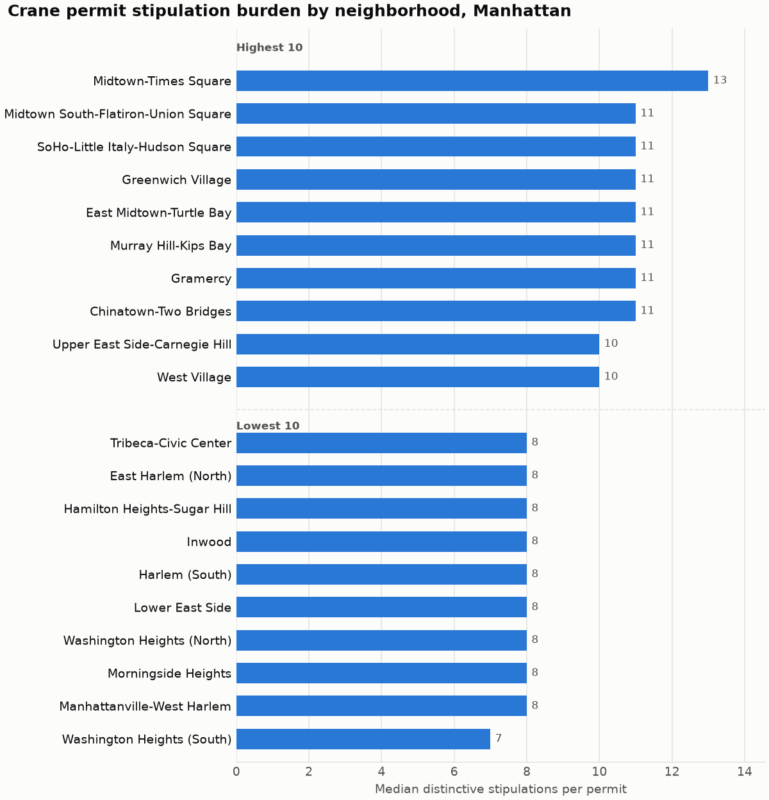

# NYC Crane Logistics Cartogram

A map of New York City where distance means **how hard and expensive it is to get a crane onto the street**, not miles. Neighborhoods with heavy permit conditions, costly cranes and tight streets stretch out; easy ones shrink.

The project combines three messy data sources (street widths and crane permits from NYC Open Data, and hand-collected crane rental prices) into one "logistics friction" score per neighborhood, then deforms the map by it.

## Progress

| # | Mini-project | Status |
|---|---|---|
| 1 | Street data: street widths from the NYC centerline | Done |
| 2 | Permit data: DOT crane permit friction by neighborhood | **Done** ([notes](docs/PROJECT_2_NOTES.md)) |
| 3 | Crane pricing | Next |
| 4 | Data synthesis and friction score | Planned |
| 5 | Interactive map | Planned |
| 6 | Cartogram | Planned |

## Latest result: crane permit friction in Manhattan

Every crane placed on a NYC street needs a Department of Transportation permit, and DOT attaches conditions to each one: flaggers, weekend-only work, road-closure notices, temporary bike lanes. Project 2 analyzed **7,630 Manhattan crane permits from 2022 to 2026** and measured two things per neighborhood.

**Stipulation burden differs sharply.** After removing boilerplate that appears on every permit, a crane permit in Midtown-Times Square carries a median of 13 site-specific conditions. In Washington Heights it carries 7.



**Lead time barely differs.** DOT issues a new crane permit a median of 5 days after application, and neighborhood medians only range from 2 to 7 days. For Manhattan, the friction is in *what DOT requires*, not *how long it takes*.

Full method, data quality funnel, limitations and open questions: [docs/PROJECT_2_NOTES.md](docs/PROJECT_2_NOTES.md).

## How it works

Project 2 is a five-stage pipeline. Each stage writes a file the next one reads, so any stage can be rerun and checked on its own.

| Stage | Script | What it does |
|---|---|---|
| 1 | `scripts/01_download.py` | Downloads crane permits, their stipulations and neighborhood boundaries from NYC Open Data, checking each file against the API's row count |
| 2 | `scripts/02_verify_tracking_id.py` | Tests whether the permit tracking ID encodes the application date, before lead time relies on it |
| 3 | `scripts/03_clean.py` | Locates every permit: DOT geometry where present, otherwise geocoding "street between cross street and cross street" against the city centerline. Assigns each to a neighborhood and flags problems |
| 4 | `scripts/04_analyze.py` | Separates boilerplate stipulation codes from distinctive ones, computes lead time, and rolls both up per neighborhood |
| 5 | `scripts/05_visualize.py` | Draws the charts in `outputs/` |

Reusable logic lives in `src/` and is covered by 61 unit tests in `tests/`.

A few problems the data forced the method to solve:

- **No application date in the data.** The tracking ID's first 8 digits look like one. A dedicated check confirmed it on all 16,508 permits (every ID parses as a date, none falls after its issue date) before lead time used it.
- **23% of permits have no map location.** They are placed from their street description instead, which recovers all but 0.4% of Manhattan permits.
- **Neighborhood borders run down the middle of streets.** A crane on Fifth Avenue serving an Upper East Side building was landing in "Central Park." Points on park edges are moved to the neighboring residential area.

## Run it

Requires Python 3.14 and `curl`.

```bash
python3 -m venv .venv
.venv/bin/pip install -r requirements.txt
.venv/bin/pytest                      # 61 tests

.venv/bin/python scripts/01_download.py        # about 5 minutes
.venv/bin/python scripts/02_verify_tracking_id.py
.venv/bin/python scripts/03_clean.py
.venv/bin/python scripts/04_analyze.py
.venv/bin/python scripts/05_visualize.py
```

Stage 3 also needs the NYC street centerline CSV (`Centerline_20260828.csv`) in `data/raw/`, downloaded as CSV from [NYC Open Data](https://data.cityofnewyork.us/d/inkn-q76z).

Settings such as the borough list, date range and thresholds are in `src/config.py`. To analyze another borough, add it to `BOROUGHS`.

## Data sources

All from [NYC Open Data](https://opendata.cityofnewyork.us/):

- Street Construction Permits, 2022–Present (`tqtj-sjs8`)
- Street Construction Permits – Stipulations, 2020–Present (`gsgx-6efw`)
- Street Construction Permits – Cranes (`hcv3-zacv`)
- 2020 Neighborhood Tabulation Areas (`9nt8-h7nd`)
- Centerline (`inkn-q76z`)

## Repository layout

```
src/        reusable modules (download, geocoding, metrics)
scripts/    numbered pipeline stages, run in order
tests/      pytest unit tests for src/
data/       raw downloads (not committed) and processed results
outputs/    charts
docs/       project notes, design spec and implementation plan
reference/  first attempt at Project 1, kept for reference
```
